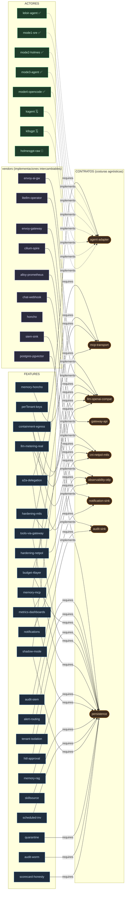

```mermaid
graph LR
  classDef con fill:#3d2b1f,stroke:#c9760a,color:#f5d9b0;
  classDef dep fill:#2b2b3d,stroke:#6f6fbf,color:#d9d9f5;
  classDef feat fill:#1f2d3d,stroke:#3f7fbf,color:#cfe3f5;
  classDef actor fill:#1f3d2b,stroke:#3fbf7f,color:#cff5e0;
  subgraph CONTRATOS["CONTRATOS (costuras agnósticas)"]
    K_agent_adapter(["agent-adapter"]):::con
    K_mcp_transport(["mcp-transport"]):::con
    K_llm_openai_compat(["llm-openai-compat"]):::con
    K_gateway_api(["gateway-api"]):::con
    K_cni_netpol_mtls(["cni-netpol-mtls"]):::con
    K_observability_otlp(["observability-otlp"]):::con
    K_notification_sink(["notification-sink"]):::con
    K_audit_sink(["audit-sink"]):::con
    K_persistence(["persistence"]):::con
  end
  subgraph VENDORS["vendors (implementaciones intercambiables)"]
    D_postgres_pgvector["postgres-pgvector"]:::dep
    D_envoy_ai_gw["envoy-ai-gw"]:::dep
    D_litellm_operator["litellm-operator"]:::dep
    D_cilium_spire["cilium-spire"]:::dep
    D_envoy_gateway["envoy-gateway"]:::dep
    D_alloy_prometheus["alloy-prometheus"]:::dep
    D_honcho["honcho"]:::dep
    D_chat_webhook["chat-webhook"]:::dep
    D_siem_sink["siem-sink"]:::dep
  end
  subgraph FEATURES
    F_alert_routing["alert-routing"]:::feat
    F_tenant_isolation["tenant-isolation"]:::feat
    F_budget_4layer["budget-4layer"]:::feat
    F_llm_metering_real["llm-metering-real"]:::feat
    F_perTenant_keys["perTenant-keys"]:::feat
    F_hitl_approval["hitl-approval"]:::feat
    F_a2a_delegation["a2a-delegation"]:::feat
    F_tools_via_gateway["tools-via-gateway"]:::feat
    F_memory_rag["memory-rag"]:::feat
    F_memory_mcp["memory-mcp"]:::feat
    F_memory_honcho["memory-honcho"]:::feat
    F_containment_egress["containment-egress"]:::feat
    F_hardening_mtls["hardening-mtls"]:::feat
    F_hardening_netpol["hardening-netpol"]:::feat
    F_skillsource["skillsource"]:::feat
    F_scheduled_inv["scheduled-inv"]:::feat
    F_shadow_mode["shadow-mode"]:::feat
    F_quarantine["quarantine"]:::feat
    F_audit_worm["audit-worm"]:::feat
    F_audit_siem["audit-siem"]:::feat
    F_notifications["notifications"]:::feat
    F_metrics_dashboards["metrics-dashboards"]:::feat
    F_scorecard_honesty["scorecard-honesty"]:::feat
  end
  subgraph ACTORES
    A_leloir_agent["leloir-agent ✅"]:::actor
    A_mode1_sre["mode1-sre ✅"]:::actor
    A_mode2_holmes["mode2-holmes ✅"]:::actor
    A_mode3_agent["mode3-agent ✅"]:::actor
    A_mode4_opencode["mode4-opencode ✅"]:::actor
    A_kagent["kagent 🗓"]:::actor
    A_k8sgpt["k8sgpt 🗓"]:::actor
    A_holmesgpt_raw["holmesgpt-raw 🔴"]:::actor
  end
  D_postgres_pgvector -->|implements| K_persistence
  D_envoy_ai_gw -->|implements| K_llm_openai_compat
  D_litellm_operator -->|implements| K_llm_openai_compat
  D_cilium_spire -->|implements| K_cni_netpol_mtls
  D_envoy_gateway -->|implements| K_gateway_api
  D_alloy_prometheus -->|implements| K_observability_otlp
  D_chat_webhook -->|implements| K_notification_sink
  D_siem_sink -->|implements| K_audit_sink
  F_alert_routing -->|requires| K_persistence
  F_tenant_isolation -->|requires| K_persistence
  F_budget_4layer -->|requires| K_llm_openai_compat
  F_budget_4layer -->|requires| K_persistence
  F_llm_metering_real -->|requires| K_llm_openai_compat
  F_llm_metering_real -->|requires| K_observability_otlp
  F_perTenant_keys -->|requires| K_llm_openai_compat
  F_hitl_approval -->|requires| K_persistence
  F_a2a_delegation -->|requires| K_agent_adapter
  F_a2a_delegation -->|requires| K_persistence
  F_tools_via_gateway -->|requires| K_mcp_transport
  F_tools_via_gateway -->|requires| K_persistence
  F_memory_rag -->|requires| K_persistence
  F_memory_mcp -->|requires| K_mcp_transport
  F_memory_mcp -->|requires| K_persistence
  F_memory_honcho -->|requires| K_mcp_transport
  F_containment_egress -->|requires| K_cni_netpol_mtls
  F_containment_egress -->|requires| K_llm_openai_compat
  F_hardening_mtls -->|requires| K_cni_netpol_mtls
  F_hardening_netpol -->|requires| K_cni_netpol_mtls
  F_skillsource -->|requires| K_persistence
  F_scheduled_inv -->|requires| K_persistence
  F_shadow_mode -->|requires| K_mcp_transport
  F_shadow_mode -->|requires| K_persistence
  F_quarantine -->|requires| K_persistence
  F_audit_worm -->|requires| K_persistence
  F_audit_siem -->|requires| K_audit_sink
  F_notifications -->|requires| K_notification_sink
  F_metrics_dashboards -->|requires| K_observability_otlp
  F_scorecard_honesty -->|requires| K_persistence
  A_leloir_agent -.->|implements| K_agent_adapter
  A_mode1_sre -.->|implements| K_agent_adapter
  A_mode2_holmes -.->|implements| K_agent_adapter
  A_mode3_agent -.->|implements| K_agent_adapter
  A_mode4_opencode -.->|implements| K_agent_adapter
  A_kagent -.->|implements| K_agent_adapter
  A_k8sgpt -.->|implements| K_agent_adapter
```
